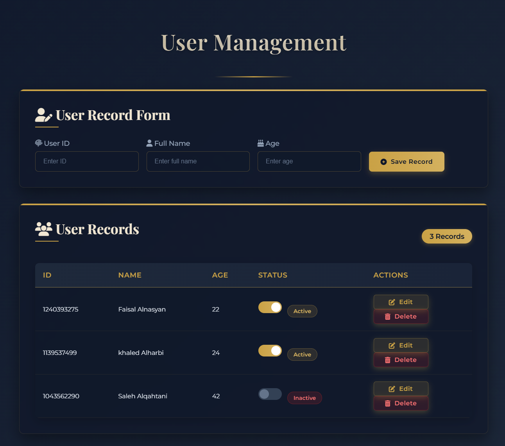

# 💼 User Management Web App



A responsive and modern web application that allows you to manage user records with ease and style. Built with HTML, CSS, JavaScript, PHP, and MySQL — everything is contained in a **single `index.php` file** for simplicity and portability.

---

## ✨ Features

- 📱 **Fully Responsive:** Works on mobile, tablet, and desktop devices  
- ➕ **Add Users:** Create new records with custom or auto-generated IDs  
- 🔄 **Update Status:** Toggle user status with a smooth switch UI  
- ✏️ **Edit Records:** Modify user details quickly and easily  
- 🗑️ **Delete Records:** Remove users with confirmation dialog  
- 📊 **Real-time Updates:** Changes are reflected instantly with no page reload  

---

## 🛠️ Technologies Used

- **Frontend:** HTML5, CSS3, JavaScript  
- **Backend:** PHP  
- **Database:** MySQL  
- **Libraries:** [Font Awesome](https://fontawesome.com/) for icons  
- **Fonts:** [Google Fonts](https://fonts.google.com/) – *Playfair Display*, *Montserrat*

---

## 🚀 Installation Guide

### 🔧 Prerequisites

- XAMPP (or any local PHP/MySQL environment)  
- A modern web browser

### 🧩 Setup Instructions

1. **Start Servers:**
   - Open the XAMPP Control Panel
   - Start **Apache** and **MySQL**

2. **Create the Database:**
   - Open [http://localhost/phpmyadmin](http://localhost/phpmyadmin)
   - Create a new database named: `info`
   - Run the following SQL query to create the `user` table:

     ```sql
     CREATE TABLE `user` (
       `id` int(11) NOT NULL AUTO_INCREMENT,
       `name` varchar(100) NOT NULL,
       `age` int(11) NOT NULL,
       `status` tinyint(1) NOT NULL DEFAULT 0,
       PRIMARY KEY (`id`)
     ) ENGINE=InnoDB DEFAULT CHARSET=utf8mb4;
     ```

3. **Download & Place Files:**
   - Clone this repository or download the ZIP file
   - Extract the contents
   - Place the `index.php` file in your XAMPP `htdocs` directory (for example):
     ```
     C:\xampp\htdocs\user-app
     ```

4. **Access the Application:**
   - Open your web browser and navigate to:
     ```
     http://localhost/user-app/
     ```
   - You should now see the application running locally

---

## 🧑‍💻 How to Use

### ➕ Add a New User:
- Fill in the **Name** and **Age** fields  
- Leave **ID** as `0` to auto-generate (or enter your own)  
- Click **Save Record**

### ✏️ Edit an Existing User:
- Click the **Edit** button next to the user you want to modify  
- The form will populate with that user's data  
- Make your changes and click **Update Record**

### 🔄 Toggle Status:
- Flip the switch in the **Status** column to change a user's status  
- The update saves immediately without reloading the page

### 🗑️ Delete a User:
- Click the **Delete** button next to a user  
- Confirm the deletion when prompted  
- The user will be removed from both the table and the database

---

## 🎨 Customization

You can customize the app by editing `index.php`:

- **Colors and Theme:** Modify the CSS inside the `<style>` tag  
- **Database Settings:** Change the credentials at the top of the file  
- **Extend Functionality:** Add more PHP or JavaScript as needed
